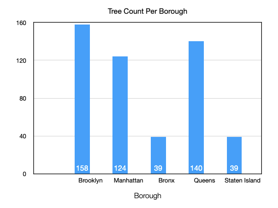
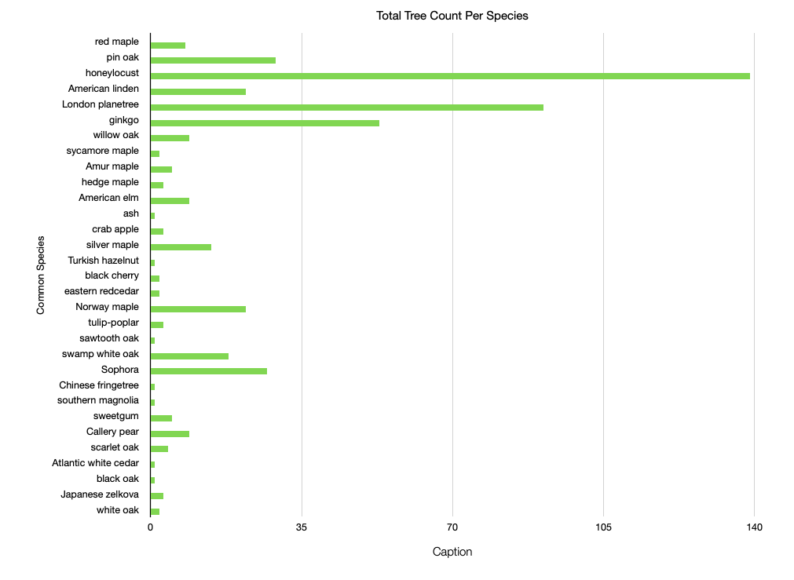

# About the Data Set of My Choice
This is a data set, conducted in 2015 by volunteers and staff to local urban environmental organizations, reporting facts about New York City's trees. In this set is recorded both public perceptions of the overall wellbeing of trees in the city, and factual statistics reflecting the state of existence of our beloved trees. This data measures, among other things, the overall impact of a tree on surrounding infrastracture (e.g. the structural state of the sidewalk next to which the tree is planted), the status of the tree (i.e. dead, alive, or stump), and the different species of trees. [See Data Set here](https://data.cityofnewyork.us/Environment/2015-Street-Tree-Census-Tree-Data/uvpi-gqnh/about_data)
## File Format
This data set was originally imported in .csv format for excel. 
# The Data Munging Process
Due to an unexpected encoding error that occured when reading the original file from the Python IDE, I had to copy only the first 500 lines of the original data set into a local csv file. Thereafter, the process was relatively smooth and I ensured that my munge.py program would work with any given number of lines. One particular hurdle in 'scrubbing' the data was removing unneccessary fields and their corresponding values. I realized that setting up a for loop to iterate through the contents of a dictionary or list while altering or removing the items would cause several errors. To avoid any potential errors or unexpected changes in the indexing process, I had to iterate through a copy of the iterable using the .copy() method and, instead of removing items, replacing the uneccessary ones with a marker string that would identify which ones were to be removed in a subsequent iteration. 
Another issue I encountered was at the final stage of writing the rows to new csv file. The issue was that some of the values that were being sent to the file contained ",", which would be read incorrectly by the parser. In order to keep values that contained several commas as one individual value, I had to set up a for loop to remove the commas. 
# Analysis
For the 'tree diameter' column, I computed the average to be about 11 inches, with the maximum diameter at 42 inches. For the 'status' column, the total count for living trees is 491 (out of 500), with only 7 dead trees in this set and 2 stumps. Furthermore, I included the total count per borough where Brooklyn, with the most amount of trees, accounts for 158 in this set, followed by Queens with 140. Next is Manhattan at 124, and Staten Island tied with the Bronx at 39. According to the spreadsheet, the most commonly occuring species of tree in all five boroughs is the honeylocust, accounting for 139 out of the 500 trees in this set.  
# Important Links
[Original Raw Data](https://drive.google.com/file/d/1fFXpdAWfhhcRH-AF9jl752_rsEBKNJrq/view?usp=drive_link),[Munged Data](data/clean_data.csv),[Spreadsheet](spreadsheet3.numbers)